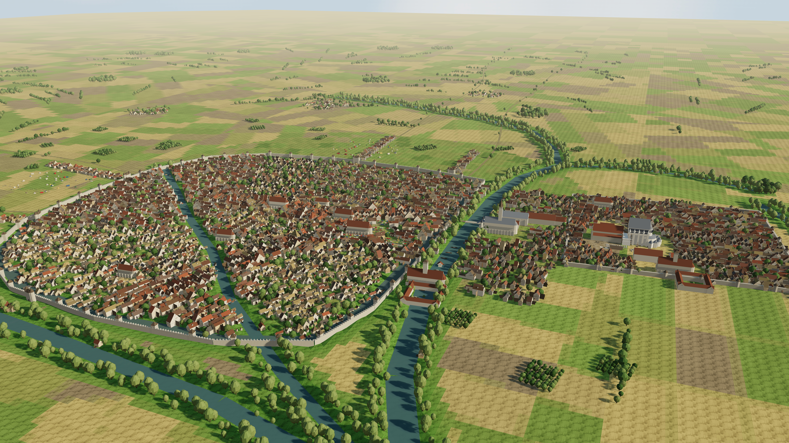

# Troyes, 1250

An 8K aerial reconstruction of Troyes on a July morning in 1250, during the Hot
Fair of Saint-Jean, built as a georeferenced 3D scene and rendered in tiles.



---

## The plates

| File | Size | View |
|---|---|---|
| `out/stills/troyes-1250-hero-8k.jpg` | 7680 × 4320 | **The main plate.** A low oblique, pitched about 25°, close enough that individual roofs, yards, gardens and trees carry the picture |
| `out/stills/troyes-1250-master-8k.jpg` | 7680 × 4320 | Higher and further back: the whole town in one frame, Bourg left, Cité right, the water between them |
| `out/stills/troyes-1250-cite.jpg` | 3840 × 2160 | The Cité from the south-west: cathedral, comital palace, Saint-Étienne, Hôtel-Dieu |
| `out/stills/troyes-1250-works.jpg` | 3840 × 2160 | Close on the cathedral works: finished chevet, roofless transept, cranes, masons' yard |
| `out/stills/troyes-1250-fair.jpg` | 3840 × 2160 | The fair quarter around Saint-Jean-au-Marché |
| `out/stills/troyes-1250-cavalier.jpg` | 3840 × 2160 | High and square-on from the south — a surveyor's cavalier view |

## What you are looking at

Troyes in 1250 is two towns joined by a bridge and separated by water.

**The Cité**, east, is the head of the champagne cork: the Gallo-Roman core
inside a late-antique wall, holding the bishop, the cathedral chapter, the abbey
of Saint-Loup and — just outside the west curtain — the comital palace, the
collegiate church of Saint-Étienne and the Hôtel-Dieu, all built by Henri le
Libéral as one programme from 1157.

**The Bourg**, west, is the body of the cork: the merchants' town, rebuilt
almost entirely since the fire of 23 July 1188, and at this moment holding one
of the two greatest commercial fairs in Europe.

Between them run the channels the counts cut through the Seine from the second
half of the 12th century — Trévois, Ru Cordé, Moline, Pielle — to drain the
marsh, drive the mills and flood the ditches.

**Three things are deliberately not in this picture**, because they were not
there:

- **Saint-Urbain.** Urban IV founds it in 1262 on his father's cobbler shop.
  In 1250 that site holds an ordinary house, and it is modelled as one.
- **A finished cathedral.** The chevet and choir are complete and ten years old;
  the transept is a roofless shell with the masons' crane standing over the
  crossing; there is no nave and no west front. Those come in the 1300s and
  1400s.
- **The Troyes of the postcards.** The tall carved jettied frames of the Ruelle
  des Chats and the Rue Champeaux are the rebuilding after the *next* great
  fire, in 1524. These houses are lower, plainer, with a shallow jetty and bare
  weathered oak — and a good deal of thatch still on the back lanes.

`docs/HISTORICAL-NOTES.md` sets out every building, what class of evidence it
rests on, and where the evidence runs out. `docs/PLACEMENT.md` gives the
coordinate frame and how to check it against a modern map.

## How it was made

No image-generation model was used, and none was available. The town is a real
3D scene: about 2.8 million triangles, 3,700 houses, 250 stalls and 2,100
figures, generated procedurally from a fixed survey of landmark positions and
rendered in headless Chromium with Three.js.

What actually makes it read as a place rather than a model, in rough order of
how much each one mattered:

- **Trees at their real size.** A hedgerow oak runs to 18 or 20 m — half as tall
  again as the houses it stands over. Drawing trees at shrub height is the
  commonest way to make a reconstruction look like a train set.
- **Burgage plots, not boxes.** A town house is the front of an L or a U: a
  street range, a rear wing down the plot, and a yard of low outbuildings behind
  that. Most of what a town looks like from above is outbuildings.
- **Roofs that are brown.** Flat clay tile weathers brown and grey within a
  decade and takes moss on the north pitch. A field of new terracotta is wrong
  for any century.
- **Working gardens.** Every plot behind the frontage carries beds of pot-herbs
  in drills, fruit trees and a vine — not lawn.
- **Wide, green-banked water.** The Seine here braids across a floodplain in
  channels the counts cut and lined with willow, with mills on them.
- **A populated middle distance.** The villages of the banlieue ring the town
  within an hour's walk, each with its church; without them the plain reads as
  empty board.

Everything is placed from `scene/js/survey.js`, which pins each landmark to a
metric coordinate derived from the site it occupies today. Nothing is positioned
by eye. The whole scene is deterministic: one seed, one town, every run.

### Tiled rendering

Chromium rasterises WebGL in software here (SwiftShader). Asking it for a single
7680 × 4320 drawing buffer is unreliable — a failed allocation tends to come back
as a silently black frame. So each plate is rendered as a grid of ordinary-sized
tiles, each with its projection offset via `Camera.setViewOffset`, and stitched
afterwards. The scene, the lights and the shadow map are identical across tiles,
so the seams are exact. The 8K master is 4 × 4 tiles of 1920 × 1080 and takes
about 40 seconds.

## Running it

```bash
npm install
npm run serve &            # static server on 127.0.0.1:8111

npm run preview            # 1920x1080 single tile, for iterating
npm run render             # the 8K hero plate

# any view, any size
node render/capture.mjs --w=7680 --h=4320 --tiles=4 --view=cite \
  --out=out/stills/cite-8k.jpg --quality=95
```

Views are `hero`, `master`, `cite`, `works`, `fair`, `cavalier`, defined in
`scene/js/main.js`. Useful flags: `--shadows=0` to render flat and fast,
`--seed=N` for a different draw of the procedural fabric, `--tiles=1` for a
single-pass render.

## Layout

```
scene/js/
  survey.js      the georeferenced skeleton — every landmark position and orientation
  geom.js        triangle-soup builder: boxes, roofs, spires, ribbons, curtains
  palette.js     colours, and the two procedural textures everything is built from
  land.js        the Seine plain, the four channels, the fields, the roads
  town.js        the houses, including the half-timbering
  walls.js       the circuit, gates, bridges and mills
  monuments.js   the cathedral works, the churches, the abbeys, the palace
  fair.js        the Hot Fair: stalls, tents, carts, crowd, river traffic
  sky.js         the sky dome, the computed sun position, smoke
  main.js        assembly, camera presets, tiled render entry point
render/
  capture.mjs    drives headless Chromium, writes the tiles
  stitch.py      glues the tiles into the final JPEG
docs/
  HISTORICAL-NOTES.md   what is evidenced, what is reasoned, what is invented
  PLACEMENT.md          the coordinate frame and how to check it
```

## The honest caveat

This was built without the ability to fetch a map or a plan — the network here
allows search but not page retrieval. The georeferencing comes from documented
site relationships plus knowledge of the modern street plan, not from measuring
a map. Expect roughly ±20 m on the churches and ±50 m on the wall lines.

The part worth trusting is the **relative arrangement**: which building stands
north or east of which, which way each one faces, and which of them existed at
all in 1250. The part to check before relying on it is the absolute metric
position of anything. `docs/PLACEMENT.md` lists every coordinate so that the
checking is possible.
